# core


<!-- WARNING: THIS FILE WAS AUTOGENERATED! DO NOT EDIT! -->

Before we get started with plotting, we should read in some toy data.
This is a modified excerpt from the *P. litorale* genome annotation,
specifically the part that holds the Hox gene cluster.

``` python
gff = util.read_gff(os.environ["EXAMPLE_DATA_PATH"] + "plit.gff3")
util.decorate(gff, attributes={"gene_id": "ID", "gene_name": "gene"})

hox_genes = [
    "PB.8615",
    "g9718",
    "PB.8616",
    "g9720",
    "g9721",
    "PB.8617",
    "g9723",
    "g9724",
    "g9725",
]
keep = gff["gene_id"].isin(hox_genes)
hox = gff[keep].reset_index(drop=True)
```

------------------------------------------------------------------------

<a
href="https://github.com/galicae/geneorder/blob/main/geneorder/core.py#L21"
target="_blank" style="float:right; font-size:smaller">source</a>

### plot_synteny

>  plot_synteny (gff, block_start:int=None, block_end:int=None,
>                    figsize:(<class'float'>,<class'float'>)=None,
>                    locus_start:str='start', locus_end:str='end',
>                    molecule:str='seqid', locus_name:str='gene_name',
>                    fig_title:str=None, save:str|pathlib.Path='synteny.svg',
>                    palette:dict|None={'aliceblue': '#F0F8FF', 'antiquewhite':
>                    '#FAEBD7', 'aqua': '#00FFFF', 'aquamarine': '#7FFFD4',
>                    'azure': '#F0FFFF', 'beige': '#F5F5DC', 'bisque':
>                    '#FFE4C4', 'black': '#000000', 'blanchedalmond': '#FFEBCD',
>                    'blue': '#0000FF', 'blueviolet': '#8A2BE2', 'brown':
>                    '#A52A2A', 'burlywood': '#DEB887', 'cadetblue': '#5F9EA0',
>                    'chartreuse': '#7FFF00', 'chocolate': '#D2691E', 'coral':
>                    '#FF7F50', 'cornflowerblue': '#6495ED', 'cornsilk':
>                    '#FFF8DC', 'crimson': '#DC143C', 'cyan': '#00FFFF',
>                    'darkblue': '#00008B', 'darkcyan': '#008B8B',
>                    'darkgoldenrod': '#B8860B', 'darkgray': '#A9A9A9',
>                    'darkgreen': '#006400', 'darkgrey': '#A9A9A9', 'darkkhaki':
>                    '#BDB76B', 'darkmagenta': '#8B008B', 'darkolivegreen':
>                    '#556B2F', 'darkorange': '#FF8C00', 'darkorchid':
>                    '#9932CC', 'darkred': '#8B0000', 'darksalmon': '#E9967A',
>                    'darkseagreen': '#8FBC8F', 'darkslateblue': '#483D8B',
>                    'darkslategray': '#2F4F4F', 'darkslategrey': '#2F4F4F',
>                    'darkturquoise': '#00CED1', 'darkviolet': '#9400D3',
>                    'deeppink': '#FF1493', 'deepskyblue': '#00BFFF', 'dimgray':
>                    '#696969', 'dimgrey': '#696969', 'dodgerblue': '#1E90FF',
>                    'firebrick': '#B22222', 'floralwhite': '#FFFAF0',
>                    'forestgreen': '#228B22', 'fuchsia': '#FF00FF',
>                    'gainsboro': '#DCDCDC', 'ghostwhite': '#F8F8FF', 'gold':
>                    '#FFD700', 'goldenrod': '#DAA520', 'gray': '#808080',
>                    'green': '#008000', 'greenyellow': '#ADFF2F', 'grey':
>                    '#808080', 'honeydew': '#F0FFF0', 'hotpink': '#FF69B4',
>                    'indianred': '#CD5C5C', 'indigo': '#4B0082', 'ivory':
>                    '#FFFFF0', 'khaki': '#F0E68C', 'lavender': '#E6E6FA',
>                    'lavenderblush': '#FFF0F5', 'lawngreen': '#7CFC00',
>                    'lemonchiffon': '#FFFACD', 'lightblue': '#ADD8E6',
>                    'lightcoral': '#F08080', 'lightcyan': '#E0FFFF',
>                    'lightgoldenrodyellow': '#FAFAD2', 'lightgray': '#D3D3D3',
>                    'lightgreen': '#90EE90', 'lightgrey': '#D3D3D3',
>                    'lightpink': '#FFB6C1', 'lightsalmon': '#FFA07A',
>                    'lightseagreen': '#20B2AA', 'lightskyblue': '#87CEFA',
>                    'lightslategray': '#778899', 'lightslategrey': '#778899',
>                    'lightsteelblue': '#B0C4DE', 'lightyellow': '#FFFFE0',
>                    'lime': '#00FF00', 'limegreen': '#32CD32', 'linen':
>                    '#FAF0E6', 'magenta': '#FF00FF', 'maroon': '#800000',
>                    'mediumaquamarine': '#66CDAA', 'mediumblue': '#0000CD',
>                    'mediumorchid': '#BA55D3', 'mediumpurple': '#9370DB',
>                    'mediumseagreen': '#3CB371', 'mediumslateblue': '#7B68EE',
>                    'mediumspringgreen': '#00FA9A', 'mediumturquoise':
>                    '#48D1CC', 'mediumvioletred': '#C71585', 'midnightblue':
>                    '#191970', 'mintcream': '#F5FFFA', 'mistyrose': '#FFE4E1',
>                    'moccasin': '#FFE4B5', 'navajowhite': '#FFDEAD', 'navy':
>                    '#000080', 'oldlace': '#FDF5E6', 'olive': '#808000',
>                    'olivedrab': '#6B8E23', 'orange': '#FFA500', 'orangered':
>                    '#FF4500', 'orchid': '#DA70D6', 'palegoldenrod': '#EEE8AA',
>                    'palegreen': '#98FB98', 'paleturquoise': '#AFEEEE',
>                    'palevioletred': '#DB7093', 'papayawhip': '#FFEFD5',
>                    'peachpuff': '#FFDAB9', 'peru': '#CD853F', 'pink':
>                    '#FFC0CB', 'plum': '#DDA0DD', 'powderblue': '#B0E0E6',
>                    'purple': '#800080', 'rebeccapurple': '#663399', 'red':
>                    '#FF0000', 'rosybrown': '#BC8F8F', 'royalblue': '#4169E1',
>                    'saddlebrown': '#8B4513', 'salmon': '#FA8072',
>                    'sandybrown': '#F4A460', 'seagreen': '#2E8B57', 'seashell':
>                    '#FFF5EE', 'sienna': '#A0522D', 'silver': '#C0C0C0',
>                    'skyblue': '#87CEEB', 'slateblue': '#6A5ACD', 'slategray':
>                    '#708090', 'slategrey': '#708090', 'snow': '#FFFAFA',
>                    'springgreen': '#00FF7F', 'steelblue': '#4682B4', 'tan':
>                    '#D2B48C', 'teal': '#008080', 'thistle': '#D8BFD8',
>                    'tomato': '#FF6347', 'turquoise': '#40E0D0', 'violet':
>                    '#EE82EE', 'wheat': '#F5DEB3', 'white': '#FFFFFF',
>                    'whitesmoke': '#F5F5F5', 'yellow': '#FFFF00',
>                    'yellowgreen': '#9ACD32'},
>                    chromosome_color:str='lightgray',
>                    backup_gene_color:str='darkgray',
>                    gene_name_offset:float=0.02, chromosome_width:float=1,
>                    gene_width:float=5)

*Function to plot a syntenic cluster of genes.*

<table>
<colgroup>
<col style="width: 6%" />
<col style="width: 25%" />
<col style="width: 34%" />
<col style="width: 34%" />
</colgroup>
<thead>
<tr>
<th></th>
<th><strong>Type</strong></th>
<th><strong>Default</strong></th>
<th><strong>Details</strong></th>
</tr>
</thead>
<tbody>
<tr>
<td>gff</td>
<td></td>
<td></td>
<td>a GFF in Pandas dataframe form. Only includes the genes of the
syntenic block in question.</td>
</tr>
<tr>
<td>block_start</td>
<td>int</td>
<td>None</td>
<td>The start coordinate of the syntenic locus to plot. If None, will be
set to the start of the first gene minus 5% of the block length.</td>
</tr>
<tr>
<td>block_end</td>
<td>int</td>
<td>None</td>
<td>The end coordinate of the syntenic locus to plot. If None, will be
set to the end of the last gene plus 5% of the block length.</td>
</tr>
<tr>
<td>figsize</td>
<td>(&lt;class ‘float’&gt;, &lt;class ‘float’&gt;)</td>
<td>None</td>
<td>the figure size.</td>
</tr>
<tr>
<td>locus_start</td>
<td>str</td>
<td>start</td>
<td>the GFF column that describes the start coordinate of the entities
(e.g. gene, mRNA) to be plotted on the chromosome. In a well-behaved
GFF, this should be “start”.</td>
</tr>
<tr>
<td>locus_end</td>
<td>str</td>
<td>end</td>
<td>the GFF column that describes the end coordinate of the entities
(e.g. gene, mRNA) to be plotted on the chromosome. In a well-behaved
GFF, this should be “end”.</td>
</tr>
<tr>
<td>molecule</td>
<td>str</td>
<td>seqid</td>
<td>the GFF column that holds the molecule name
(chromosome/scaffold/contig ID). In a well-behaved GFF, this should be
“seqid”.</td>
</tr>
<tr>
<td>locus_name</td>
<td>str</td>
<td>gene_name</td>
<td>the GFF column that holds the gene/mRNA symbol. This is usually a
tag in the “attributes” column of a well-behaved GFF and should have
been extracted prior to this step. It will be plotted according to the
<code>gene_name_offset</code> parameter.</td>
</tr>
<tr>
<td>fig_title</td>
<td>str</td>
<td>None</td>
<td>Figure title.</td>
</tr>
<tr>
<td>save</td>
<td>str | pathlib.Path</td>
<td>synteny.svg</td>
<td>path to save an SVG image.</td>
</tr>
<tr>
<td>palette</td>
<td>dict | None</td>
<td>{‘aliceblue’: ‘#F0F8FF’, ‘antiquewhite’: ‘#FAEBD7’, ‘aqua’:
‘#00FFFF’, ‘aquamarine’: ‘#7FFFD4’, ‘azure’: ‘#F0FFFF’, ‘beige’:
‘#F5F5DC’, ‘bisque’: ‘#FFE4C4’, ‘black’: ‘#000000’, ‘blanchedalmond’:
‘#FFEBCD’, ‘blue’: ‘#0000FF’, ‘blueviolet’: ‘#8A2BE2’, ‘brown’:
‘#A52A2A’, ‘burlywood’: ‘#DEB887’, ‘cadetblue’: ‘#5F9EA0’, ‘chartreuse’:
‘#7FFF00’, ‘chocolate’: ‘#D2691E’, ‘coral’: ‘#FF7F50’, ‘cornflowerblue’:
‘#6495ED’, ‘cornsilk’: ‘#FFF8DC’, ‘crimson’: ‘#DC143C’, ‘cyan’:
‘#00FFFF’, ‘darkblue’: ‘#00008B’, ‘darkcyan’: ‘#008B8B’,
‘darkgoldenrod’: ‘#B8860B’, ‘darkgray’: ‘#A9A9A9’, ‘darkgreen’:
‘#006400’, ‘darkgrey’: ‘#A9A9A9’, ‘darkkhaki’: ‘#BDB76B’, ‘darkmagenta’:
‘#8B008B’, ‘darkolivegreen’: ‘#556B2F’, ‘darkorange’: ‘#FF8C00’,
‘darkorchid’: ‘#9932CC’, ‘darkred’: ‘#8B0000’, ‘darksalmon’: ‘#E9967A’,
‘darkseagreen’: ‘#8FBC8F’, ‘darkslateblue’: ‘#483D8B’, ‘darkslategray’:
‘#2F4F4F’, ‘darkslategrey’: ‘#2F4F4F’, ‘darkturquoise’: ‘#00CED1’,
‘darkviolet’: ‘#9400D3’, ‘deeppink’: ‘#FF1493’, ‘deepskyblue’:
‘#00BFFF’, ‘dimgray’: ‘#696969’, ‘dimgrey’: ‘#696969’, ‘dodgerblue’:
‘#1E90FF’, ‘firebrick’: ‘#B22222’, ‘floralwhite’: ‘#FFFAF0’,
‘forestgreen’: ‘#228B22’, ‘fuchsia’: ‘#FF00FF’, ‘gainsboro’: ‘#DCDCDC’,
‘ghostwhite’: ‘#F8F8FF’, ‘gold’: ‘#FFD700’, ‘goldenrod’: ‘#DAA520’,
‘gray’: ‘#808080’, ‘green’: ‘#008000’, ‘greenyellow’: ‘#ADFF2F’, ‘grey’:
‘#808080’, ‘honeydew’: ‘#F0FFF0’, ‘hotpink’: ‘#FF69B4’, ‘indianred’:
‘#CD5C5C’, ‘indigo’: ‘#4B0082’, ‘ivory’: ‘#FFFFF0’, ‘khaki’: ‘#F0E68C’,
‘lavender’: ‘#E6E6FA’, ‘lavenderblush’: ‘#FFF0F5’, ‘lawngreen’:
‘#7CFC00’, ‘lemonchiffon’: ‘#FFFACD’, ‘lightblue’: ‘#ADD8E6’,
‘lightcoral’: ‘#F08080’, ‘lightcyan’: ‘#E0FFFF’, ‘lightgoldenrodyellow’:
‘#FAFAD2’, ‘lightgray’: ‘#D3D3D3’, ‘lightgreen’: ‘#90EE90’, ‘lightgrey’:
‘#D3D3D3’, ‘lightpink’: ‘#FFB6C1’, ‘lightsalmon’: ‘#FFA07A’,
‘lightseagreen’: ‘#20B2AA’, ‘lightskyblue’: ‘#87CEFA’, ‘lightslategray’:
‘#778899’, ‘lightslategrey’: ‘#778899’, ‘lightsteelblue’: ‘#B0C4DE’,
‘lightyellow’: ‘#FFFFE0’, ‘lime’: ‘#00FF00’, ‘limegreen’: ‘#32CD32’,
‘linen’: ‘#FAF0E6’, ‘magenta’: ‘#FF00FF’, ‘maroon’: ‘#800000’,
‘mediumaquamarine’: ‘#66CDAA’, ‘mediumblue’: ‘#0000CD’, ‘mediumorchid’:
‘#BA55D3’, ‘mediumpurple’: ‘#9370DB’, ‘mediumseagreen’: ‘#3CB371’,
‘mediumslateblue’: ‘#7B68EE’, ‘mediumspringgreen’: ‘#00FA9A’,
‘mediumturquoise’: ‘#48D1CC’, ‘mediumvioletred’: ‘#C71585’,
‘midnightblue’: ‘#191970’, ‘mintcream’: ‘#F5FFFA’, ‘mistyrose’:
‘#FFE4E1’, ‘moccasin’: ‘#FFE4B5’, ‘navajowhite’: ‘#FFDEAD’, ‘navy’:
‘#000080’, ‘oldlace’: ‘#FDF5E6’, ‘olive’: ‘#808000’, ‘olivedrab’:
‘#6B8E23’, ‘orange’: ‘#FFA500’, ‘orangered’: ‘#FF4500’, ‘orchid’:
‘#DA70D6’, ‘palegoldenrod’: ‘#EEE8AA’, ‘palegreen’: ‘#98FB98’,
‘paleturquoise’: ‘#AFEEEE’, ‘palevioletred’: ‘#DB7093’, ‘papayawhip’:
‘#FFEFD5’, ‘peachpuff’: ‘#FFDAB9’, ‘peru’: ‘#CD853F’, ‘pink’: ‘#FFC0CB’,
‘plum’: ‘#DDA0DD’, ‘powderblue’: ‘#B0E0E6’, ‘purple’: ‘#800080’,
‘rebeccapurple’: ‘#663399’, ‘red’: ‘#FF0000’, ‘rosybrown’: ‘#BC8F8F’,
‘royalblue’: ‘#4169E1’, ‘saddlebrown’: ‘#8B4513’, ‘salmon’: ‘#FA8072’,
‘sandybrown’: ‘#F4A460’, ‘seagreen’: ‘#2E8B57’, ‘seashell’: ‘#FFF5EE’,
‘sienna’: ‘#A0522D’, ‘silver’: ‘#C0C0C0’, ‘skyblue’: ‘#87CEEB’,
‘slateblue’: ‘#6A5ACD’, ‘slategray’: ‘#708090’, ‘slategrey’: ‘#708090’,
‘snow’: ‘#FFFAFA’, ‘springgreen’: ‘#00FF7F’, ‘steelblue’: ‘#4682B4’,
‘tan’: ‘#D2B48C’, ‘teal’: ‘#008080’, ‘thistle’: ‘#D8BFD8’, ‘tomato’:
‘#FF6347’, ‘turquoise’: ‘#40E0D0’, ‘violet’: ‘#EE82EE’, ‘wheat’:
‘#F5DEB3’, ‘white’: ‘#FFFFFF’, ‘whitesmoke’: ‘#F5F5F5’, ‘yellow’:
‘#FFFF00’, ‘yellowgreen’: ‘#9ACD32’}</td>
<td></td>
</tr>
<tr>
<td>chromosome_color</td>
<td>str</td>
<td>lightgray</td>
<td>the color of the line representing the molecule the genes are
plotted on.</td>
</tr>
<tr>
<td>backup_gene_color</td>
<td>str</td>
<td>darkgray</td>
<td>If the GFF has no column titled “color”, the gene arrows will be
filled using this color.</td>
</tr>
<tr>
<td>gene_name_offset</td>
<td>float</td>
<td>0.02</td>
<td>Default offset for plotting gene names if the GFF has no column
titled “offset”.</td>
</tr>
<tr>
<td>chromosome_width</td>
<td>float</td>
<td>1</td>
<td>Linewidth parameter for the line representing the chromosome.</td>
</tr>
<tr>
<td>gene_width</td>
<td>float</td>
<td>5</td>
<td>Width of the arrow patches representing genes. Please refer to the
documentation of <code>matplotlib.pyplot.arrow</code> for more
details.</td>
</tr>
<tr>
<td><strong>Returns</strong></td>
<td><strong>None</strong></td>
<td></td>
<td></td>
</tr>
</tbody>
</table>

We can use this function with any GFF dataframe that is reduced to one
row per gene (for example a `type: gene` or `type: mRNA` entry per
gene).

``` python
plot_synteny(hox, figsize=(11, 2))
```

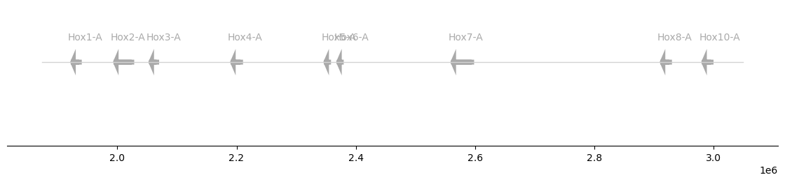

If the input GFF contains information about the color and the gene name
offsets, the plotter will use them:

``` python
hox["color"] = [
    "red",
    "orange",
    "gold",
    "lightgreen",
    "forestgreen",
    "royalblue",
    "darkblue",
    "darkmagenta",
    "magenta",
]
hox["offset"] = [0.02, -0.025, 0.02, 0.02, 0.02, -0.025, 0.02, 0.02, 0.02]
```

``` python
plot_synteny(hox, figsize=(11, 2))
hox["strand"] = ["+", "-", "+", "-", "-", "-", "+", "+", "+"]
plot_synteny(hox, figsize=(11, 2))
```

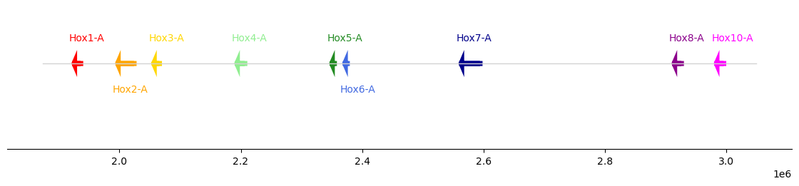

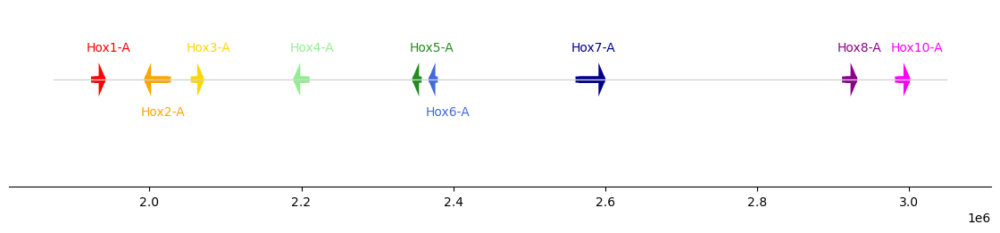

We can also use hex codes directly for coloring:

``` python
hox["color"] = [
    "#E7DAD2",
    "#CFE2B7",
    "#FA7F6F",
    "#83B0D2",
    "#BEB9DC",
    "#C0E59A",
    "#8ECFC9",
    "#FFBE79",
    "#BAAC8C",
]
```

``` python
plot_synteny(hox, figsize=(11, 2), palette=None)
```

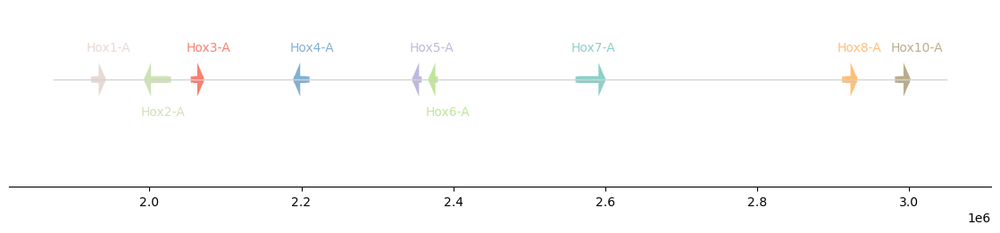

------------------------------------------------------------------------

<a
href="https://github.com/galicae/geneorder/blob/main/geneorder/core.py#L121"
target="_blank" style="float:right; font-size:smaller">source</a>

### plot_synteny_schematic

>  plot_synteny_schematic (gff:pandas.core.frame.DataFrame,
>                              block_gene:float=400, block_dist:float=200,
>                              locus_start:str='start', locus_end:str='end',
>                              molecule:str='seqid', locus_name:str='gene_name',
>                              interrupted:bool=False,
>                              palette:dict|None={'aliceblue': '#F0F8FF',
>                              'antiquewhite': '#FAEBD7', 'aqua': '#00FFFF',
>                              'aquamarine': '#7FFFD4', 'azure': '#F0FFFF',
>                              'beige': '#F5F5DC', 'bisque': '#FFE4C4', 'black':
>                              '#000000', 'blanchedalmond': '#FFEBCD', 'blue':
>                              '#0000FF', 'blueviolet': '#8A2BE2', 'brown':
>                              '#A52A2A', 'burlywood': '#DEB887', 'cadetblue':
>                              '#5F9EA0', 'chartreuse': '#7FFF00', 'chocolate':
>                              '#D2691E', 'coral': '#FF7F50', 'cornflowerblue':
>                              '#6495ED', 'cornsilk': '#FFF8DC', 'crimson':
>                              '#DC143C', 'cyan': '#00FFFF', 'darkblue':
>                              '#00008B', 'darkcyan': '#008B8B',
>                              'darkgoldenrod': '#B8860B', 'darkgray':
>                              '#A9A9A9', 'darkgreen': '#006400', 'darkgrey':
>                              '#A9A9A9', 'darkkhaki': '#BDB76B', 'darkmagenta':
>                              '#8B008B', 'darkolivegreen': '#556B2F',
>                              'darkorange': '#FF8C00', 'darkorchid': '#9932CC',
>                              'darkred': '#8B0000', 'darksalmon': '#E9967A',
>                              'darkseagreen': '#8FBC8F', 'darkslateblue':
>                              '#483D8B', 'darkslategray': '#2F4F4F',
>                              'darkslategrey': '#2F4F4F', 'darkturquoise':
>                              '#00CED1', 'darkviolet': '#9400D3', 'deeppink':
>                              '#FF1493', 'deepskyblue': '#00BFFF', 'dimgray':
>                              '#696969', 'dimgrey': '#696969', 'dodgerblue':
>                              '#1E90FF', 'firebrick': '#B22222', 'floralwhite':
>                              '#FFFAF0', 'forestgreen': '#228B22', 'fuchsia':
>                              '#FF00FF', 'gainsboro': '#DCDCDC', 'ghostwhite':
>                              '#F8F8FF', 'gold': '#FFD700', 'goldenrod':
>                              '#DAA520', 'gray': '#808080', 'green': '#008000',
>                              'greenyellow': '#ADFF2F', 'grey': '#808080',
>                              'honeydew': '#F0FFF0', 'hotpink': '#FF69B4',
>                              'indianred': '#CD5C5C', 'indigo': '#4B0082',
>                              'ivory': '#FFFFF0', 'khaki': '#F0E68C',
>                              'lavender': '#E6E6FA', 'lavenderblush':
>                              '#FFF0F5', 'lawngreen': '#7CFC00',
>                              'lemonchiffon': '#FFFACD', 'lightblue':
>                              '#ADD8E6', 'lightcoral': '#F08080', 'lightcyan':
>                              '#E0FFFF', 'lightgoldenrodyellow': '#FAFAD2',
>                              'lightgray': '#D3D3D3', 'lightgreen': '#90EE90',
>                              'lightgrey': '#D3D3D3', 'lightpink': '#FFB6C1',
>                              'lightsalmon': '#FFA07A', 'lightseagreen':
>                              '#20B2AA', 'lightskyblue': '#87CEFA',
>                              'lightslategray': '#778899', 'lightslategrey':
>                              '#778899', 'lightsteelblue': '#B0C4DE',
>                              'lightyellow': '#FFFFE0', 'lime': '#00FF00',
>                              'limegreen': '#32CD32', 'linen': '#FAF0E6',
>                              'magenta': '#FF00FF', 'maroon': '#800000',
>                              'mediumaquamarine': '#66CDAA', 'mediumblue':
>                              '#0000CD', 'mediumorchid': '#BA55D3',
>                              'mediumpurple': '#9370DB', 'mediumseagreen':
>                              '#3CB371', 'mediumslateblue': '#7B68EE',
>                              'mediumspringgreen': '#00FA9A',
>                              'mediumturquoise': '#48D1CC', 'mediumvioletred':
>                              '#C71585', 'midnightblue': '#191970',
>                              'mintcream': '#F5FFFA', 'mistyrose': '#FFE4E1',
>                              'moccasin': '#FFE4B5', 'navajowhite': '#FFDEAD',
>                              'navy': '#000080', 'oldlace': '#FDF5E6', 'olive':
>                              '#808000', 'olivedrab': '#6B8E23', 'orange':
>                              '#FFA500', 'orangered': '#FF4500', 'orchid':
>                              '#DA70D6', 'palegoldenrod': '#EEE8AA',
>                              'palegreen': '#98FB98', 'paleturquoise':
>                              '#AFEEEE', 'palevioletred': '#DB7093',
>                              'papayawhip': '#FFEFD5', 'peachpuff': '#FFDAB9',
>                              'peru': '#CD853F', 'pink': '#FFC0CB', 'plum':
>                              '#DDA0DD', 'powderblue': '#B0E0E6', 'purple':
>                              '#800080', 'rebeccapurple': '#663399', 'red':
>                              '#FF0000', 'rosybrown': '#BC8F8F', 'royalblue':
>                              '#4169E1', 'saddlebrown': '#8B4513', 'salmon':
>                              '#FA8072', 'sandybrown': '#F4A460', 'seagreen':
>                              '#2E8B57', 'seashell': '#FFF5EE', 'sienna':
>                              '#A0522D', 'silver': '#C0C0C0', 'skyblue':
>                              '#87CEEB', 'slateblue': '#6A5ACD', 'slategray':
>                              '#708090', 'slategrey': '#708090', 'snow':
>                              '#FFFAFA', 'springgreen': '#00FF7F', 'steelblue':
>                              '#4682B4', 'tan': '#D2B48C', 'teal': '#008080',
>                              'thistle': '#D8BFD8', 'tomato': '#FF6347',
>                              'turquoise': '#40E0D0', 'violet': '#EE82EE',
>                              'wheat': '#F5DEB3', 'white': '#FFFFFF',
>                              'whitesmoke': '#F5F5F5', 'yellow': '#FFFF00',
>                              'yellowgreen': '#9ACD32'}, fontsize:int=30,
>                              chromosome_color:str='black',
>                              backup_gene_color:str='darkgray',
>                              gene_name_offset:float=0.02,
>                              chromosome_width:float=3, head_length:float=200,
>                              head_width:float=1.7, gene_width:float=1,
>                              ax:matplotlib.axes._axes.Axes=None,
>                              figsize:(<class'float'>,<class'float'>)=None,
>                              save:str|pathlib.Path='schematic.svg',
>                              return_fig:bool=False)

<table>
<colgroup>
<col style="width: 6%" />
<col style="width: 25%" />
<col style="width: 34%" />
<col style="width: 34%" />
</colgroup>
<thead>
<tr>
<th></th>
<th><strong>Type</strong></th>
<th><strong>Default</strong></th>
<th><strong>Details</strong></th>
</tr>
</thead>
<tbody>
<tr>
<td>gff</td>
<td>DataFrame</td>
<td></td>
<td>a GFF in Pandas dataframe form. Only includes the genes of the
syntenic block in question. Assumed to be sorted in plotting order.</td>
</tr>
<tr>
<td>block_gene</td>
<td>float</td>
<td>400</td>
<td>length of a gene arrow, in plot coordinate space.</td>
</tr>
<tr>
<td>block_dist</td>
<td>float</td>
<td>200</td>
<td>length of gap between successive genes, in plot coordinate
space.</td>
</tr>
<tr>
<td>locus_start</td>
<td>str</td>
<td>start</td>
<td>the GFF column that describes the start coordinate of the entities
(e.g. gene, mRNA) to be plotted on the chromosome. In a well-behaved
GFF, this should be “start”.</td>
</tr>
<tr>
<td>locus_end</td>
<td>str</td>
<td>end</td>
<td>the GFF column that describes the end coordinate of the entities
(e.g. gene, mRNA) to be plotted on the chromosome. In a well-behaved
GFF, this should be “end”.</td>
</tr>
<tr>
<td>molecule</td>
<td>str</td>
<td>seqid</td>
<td>the GFF column that holds the molecule name
(chromosome/scaffold/contig ID). In a well-behaved GFF, this should be
“seqid”.</td>
</tr>
<tr>
<td>locus_name</td>
<td>str</td>
<td>gene_name</td>
<td>the GFF column that holds the gene/mRNA symbol. This is usually a
tag in the “attributes” column of a well-behaved GFF and should have
been extracted prior to this step. It will be plotted according to the
<code>gene_name_offset</code> parameter.</td>
</tr>
<tr>
<td>interrupted</td>
<td>bool</td>
<td>False</td>
<td>is the syntenic cluster on multiple pseudomolecules?</td>
</tr>
<tr>
<td>palette</td>
<td>dict | None</td>
<td>{‘aliceblue’: ‘#F0F8FF’, ‘antiquewhite’: ‘#FAEBD7’, ‘aqua’:
‘#00FFFF’, ‘aquamarine’: ‘#7FFFD4’, ‘azure’: ‘#F0FFFF’, ‘beige’:
‘#F5F5DC’, ‘bisque’: ‘#FFE4C4’, ‘black’: ‘#000000’, ‘blanchedalmond’:
‘#FFEBCD’, ‘blue’: ‘#0000FF’, ‘blueviolet’: ‘#8A2BE2’, ‘brown’:
‘#A52A2A’, ‘burlywood’: ‘#DEB887’, ‘cadetblue’: ‘#5F9EA0’, ‘chartreuse’:
‘#7FFF00’, ‘chocolate’: ‘#D2691E’, ‘coral’: ‘#FF7F50’, ‘cornflowerblue’:
‘#6495ED’, ‘cornsilk’: ‘#FFF8DC’, ‘crimson’: ‘#DC143C’, ‘cyan’:
‘#00FFFF’, ‘darkblue’: ‘#00008B’, ‘darkcyan’: ‘#008B8B’,
‘darkgoldenrod’: ‘#B8860B’, ‘darkgray’: ‘#A9A9A9’, ‘darkgreen’:
‘#006400’, ‘darkgrey’: ‘#A9A9A9’, ‘darkkhaki’: ‘#BDB76B’, ‘darkmagenta’:
‘#8B008B’, ‘darkolivegreen’: ‘#556B2F’, ‘darkorange’: ‘#FF8C00’,
‘darkorchid’: ‘#9932CC’, ‘darkred’: ‘#8B0000’, ‘darksalmon’: ‘#E9967A’,
‘darkseagreen’: ‘#8FBC8F’, ‘darkslateblue’: ‘#483D8B’, ‘darkslategray’:
‘#2F4F4F’, ‘darkslategrey’: ‘#2F4F4F’, ‘darkturquoise’: ‘#00CED1’,
‘darkviolet’: ‘#9400D3’, ‘deeppink’: ‘#FF1493’, ‘deepskyblue’:
‘#00BFFF’, ‘dimgray’: ‘#696969’, ‘dimgrey’: ‘#696969’, ‘dodgerblue’:
‘#1E90FF’, ‘firebrick’: ‘#B22222’, ‘floralwhite’: ‘#FFFAF0’,
‘forestgreen’: ‘#228B22’, ‘fuchsia’: ‘#FF00FF’, ‘gainsboro’: ‘#DCDCDC’,
‘ghostwhite’: ‘#F8F8FF’, ‘gold’: ‘#FFD700’, ‘goldenrod’: ‘#DAA520’,
‘gray’: ‘#808080’, ‘green’: ‘#008000’, ‘greenyellow’: ‘#ADFF2F’, ‘grey’:
‘#808080’, ‘honeydew’: ‘#F0FFF0’, ‘hotpink’: ‘#FF69B4’, ‘indianred’:
‘#CD5C5C’, ‘indigo’: ‘#4B0082’, ‘ivory’: ‘#FFFFF0’, ‘khaki’: ‘#F0E68C’,
‘lavender’: ‘#E6E6FA’, ‘lavenderblush’: ‘#FFF0F5’, ‘lawngreen’:
‘#7CFC00’, ‘lemonchiffon’: ‘#FFFACD’, ‘lightblue’: ‘#ADD8E6’,
‘lightcoral’: ‘#F08080’, ‘lightcyan’: ‘#E0FFFF’, ‘lightgoldenrodyellow’:
‘#FAFAD2’, ‘lightgray’: ‘#D3D3D3’, ‘lightgreen’: ‘#90EE90’, ‘lightgrey’:
‘#D3D3D3’, ‘lightpink’: ‘#FFB6C1’, ‘lightsalmon’: ‘#FFA07A’,
‘lightseagreen’: ‘#20B2AA’, ‘lightskyblue’: ‘#87CEFA’, ‘lightslategray’:
‘#778899’, ‘lightslategrey’: ‘#778899’, ‘lightsteelblue’: ‘#B0C4DE’,
‘lightyellow’: ‘#FFFFE0’, ‘lime’: ‘#00FF00’, ‘limegreen’: ‘#32CD32’,
‘linen’: ‘#FAF0E6’, ‘magenta’: ‘#FF00FF’, ‘maroon’: ‘#800000’,
‘mediumaquamarine’: ‘#66CDAA’, ‘mediumblue’: ‘#0000CD’, ‘mediumorchid’:
‘#BA55D3’, ‘mediumpurple’: ‘#9370DB’, ‘mediumseagreen’: ‘#3CB371’,
‘mediumslateblue’: ‘#7B68EE’, ‘mediumspringgreen’: ‘#00FA9A’,
‘mediumturquoise’: ‘#48D1CC’, ‘mediumvioletred’: ‘#C71585’,
‘midnightblue’: ‘#191970’, ‘mintcream’: ‘#F5FFFA’, ‘mistyrose’:
‘#FFE4E1’, ‘moccasin’: ‘#FFE4B5’, ‘navajowhite’: ‘#FFDEAD’, ‘navy’:
‘#000080’, ‘oldlace’: ‘#FDF5E6’, ‘olive’: ‘#808000’, ‘olivedrab’:
‘#6B8E23’, ‘orange’: ‘#FFA500’, ‘orangered’: ‘#FF4500’, ‘orchid’:
‘#DA70D6’, ‘palegoldenrod’: ‘#EEE8AA’, ‘palegreen’: ‘#98FB98’,
‘paleturquoise’: ‘#AFEEEE’, ‘palevioletred’: ‘#DB7093’, ‘papayawhip’:
‘#FFEFD5’, ‘peachpuff’: ‘#FFDAB9’, ‘peru’: ‘#CD853F’, ‘pink’: ‘#FFC0CB’,
‘plum’: ‘#DDA0DD’, ‘powderblue’: ‘#B0E0E6’, ‘purple’: ‘#800080’,
‘rebeccapurple’: ‘#663399’, ‘red’: ‘#FF0000’, ‘rosybrown’: ‘#BC8F8F’,
‘royalblue’: ‘#4169E1’, ‘saddlebrown’: ‘#8B4513’, ‘salmon’: ‘#FA8072’,
‘sandybrown’: ‘#F4A460’, ‘seagreen’: ‘#2E8B57’, ‘seashell’: ‘#FFF5EE’,
‘sienna’: ‘#A0522D’, ‘silver’: ‘#C0C0C0’, ‘skyblue’: ‘#87CEEB’,
‘slateblue’: ‘#6A5ACD’, ‘slategray’: ‘#708090’, ‘slategrey’: ‘#708090’,
‘snow’: ‘#FFFAFA’, ‘springgreen’: ‘#00FF7F’, ‘steelblue’: ‘#4682B4’,
‘tan’: ‘#D2B48C’, ‘teal’: ‘#008080’, ‘thistle’: ‘#D8BFD8’, ‘tomato’:
‘#FF6347’, ‘turquoise’: ‘#40E0D0’, ‘violet’: ‘#EE82EE’, ‘wheat’:
‘#F5DEB3’, ‘white’: ‘#FFFFFF’, ‘whitesmoke’: ‘#F5F5F5’, ‘yellow’:
‘#FFFF00’, ‘yellowgreen’: ‘#9ACD32’}</td>
<td></td>
</tr>
<tr>
<td>fontsize</td>
<td>int</td>
<td>30</td>
<td>this fontsize works well for default sizes, but is probably too big
for smaller plots</td>
</tr>
<tr>
<td>chromosome_color</td>
<td>str</td>
<td>black</td>
<td>the color of the line representing the molecule the genes are
plotted on.</td>
</tr>
<tr>
<td>backup_gene_color</td>
<td>str</td>
<td>darkgray</td>
<td>If the GFF has no column titled “color”, the gene arrows will be
filled using this color.</td>
</tr>
<tr>
<td>gene_name_offset</td>
<td>float</td>
<td>0.02</td>
<td>Default offset for plotting gene names if the GFF has no column
titled “offset”.</td>
</tr>
<tr>
<td>chromosome_width</td>
<td>float</td>
<td>3</td>
<td>Linewidth parameter for the line representing the chromosome; also,
patch linewidth of the arrows representing genes. Please refer to the
documentation of <code>matplotlib.patches.FancyArrowPath</code> for more
details.</td>
</tr>
<tr>
<td>head_length</td>
<td>float</td>
<td>200</td>
<td>Head length for the arrows representing genes. Please refer to the
documentation of <code>matplotlib.patches.FancyArrowPath</code> for more
details.</td>
</tr>
<tr>
<td>head_width</td>
<td>float</td>
<td>1.7</td>
<td>Head width for the arrows representing genes. Please refer to the
documentation of <code>matplotlib.patches.FancyArrowPath</code> for more
details.</td>
</tr>
<tr>
<td>gene_width</td>
<td>float</td>
<td>1</td>
<td>Width of the arrow patches representing genes. Please refer to the
documentation of <code>matplotlib.patches.FancyArrowPath</code> for more
details.</td>
</tr>
<tr>
<td>ax</td>
<td>Axes</td>
<td>None</td>
<td>a pre-existing matplotlib axes object, if you wish to include this
plot in a composite.</td>
</tr>
<tr>
<td>figsize</td>
<td>(&lt;class ‘float’&gt;, &lt;class ‘float’&gt;)</td>
<td>None</td>
<td></td>
</tr>
<tr>
<td>save</td>
<td>str | pathlib.Path</td>
<td>schematic.svg</td>
<td>path to save an SVG image.</td>
</tr>
<tr>
<td>return_fig</td>
<td>bool</td>
<td>False</td>
<td>whether to return an axes object. Useful for further manipulation of
the plot.</td>
</tr>
<tr>
<td><strong>Returns</strong></td>
<td><strong>matplotlib.figure.Figure | matplotlib.axes._axes.Axes |
None</strong></td>
<td></td>
<td></td>
</tr>
</tbody>
</table>

``` python
hox["color"] = [
    "red",
    "orange",
    "gold",
    "lightgreen",
    "forestgreen",
    "royalblue",
    "darkblue",
    "darkmagenta",
    "magenta",
]
hox["offset"] = 0.02
hox["strand"] = "-"
```

Sometimes (many times) we are not interested in plotting syntenic genes
with their real distances; rather, we are interested in the order and
orientation of the genes. This representation can be achieved with the
[`plot_synteny_schematic`](https://galicae.github.io/geneorder/core.html#plot_synteny_schematic)
function, that can process the same sort of input as
[`plot_synteny`](https://galicae.github.io/geneorder/core.html#plot_synteny).

``` python
plot_synteny_schematic(hox)
```

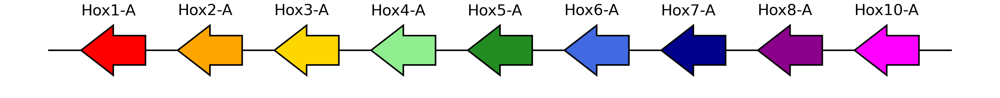

The strand is reflected on the orientation of the arrows - genes on the
plus strand point right.

``` python
hox["strand"] = "+"
plot_synteny_schematic(hox)
```

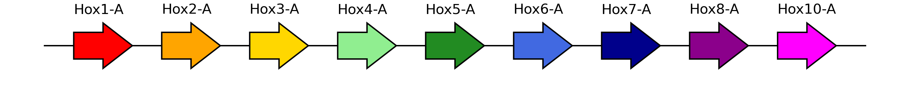

The `geneorder` package uses `matplotlib.patches.FancyArrow` for the
schematic plots, and hence the shape of the arrowhead can be precisely
controlled:

``` python
plot_synteny_schematic(hox, head_length=100, head_width=3)
plot_synteny_schematic(hox, head_length=300, head_width=1.0)
```

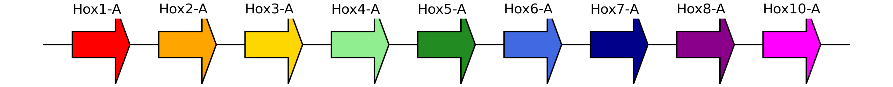

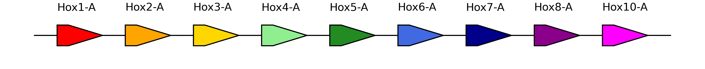

An interesting edge case is setting the head width and length both to
`0`, in order to plot rectangles. This may be useful if the orientation
of the features is not important:

``` python
plot_synteny_schematic(hox, head_length=0, head_width=0)
```

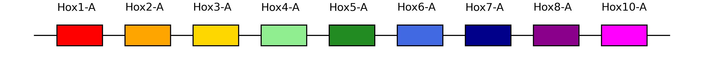

Sometimes we will not have information about the orientation of single
genes, for instance when there is no gene model predicted. In those
cases, the `strand` can be set to `.`, something the GFF standard often
uses to denote missing values. The width of the block will still be
equivalent to the arrows, but no arrowhead will be plotted.

``` python
hox["strand"] = ["+", "+", "+", "+", ".", ".", "-", "-", "+"]
```

``` python
plot_synteny_schematic(hox)
```

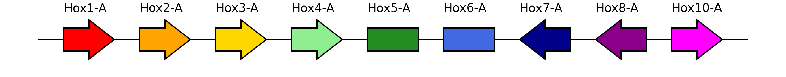

Similarly, we may want to highlight one or multiple of the genes, for
instance because they were annotated via a different route. `geneorder`
accepts an `edge_color` parameter in the input “GFF”, and will plot
black edges if not otherwise instructed.

Let’s say we want to highlight all genes that were based on PacBio
transcripts:

``` python
hox["edge_color"] = hox["source"].replace({"PacBio": "cyan", "AUGUSTUS": "black"})
```

``` python
plot_synteny_schematic(hox)
```

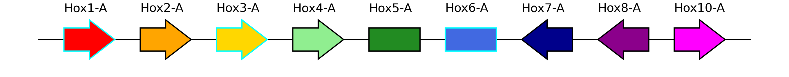

The keen reader will have noticed that there is no gap between Hox8 and
Hox10 - even though Hox9 is missing. We can edit the GFF dataframe to
amend this:

``` python
hox["strand"] = "+"
hox["edge_color"] = "black"
```

``` python
hox = util.insert_gap(
    hox,
    "g9724",
    "g9725",
    "gene_id",
    no_gaps=1,
    purge_columns=["gene_name", "color", "offset", "attributes"],
)
```

``` python
hox
```

<div>
<style scoped>
    .dataframe tbody tr th:only-of-type {
        vertical-align: middle;
    }
&#10;    .dataframe tbody tr th {
        vertical-align: top;
    }
&#10;    .dataframe thead th {
        text-align: right;
    }
</style>

<table class="dataframe" data-quarto-postprocess="true" data-border="1">
<thead>
<tr style="text-align: right;">
<th data-quarto-table-cell-role="th"></th>
<th data-quarto-table-cell-role="th">seqid</th>
<th data-quarto-table-cell-role="th">source</th>
<th data-quarto-table-cell-role="th">type</th>
<th data-quarto-table-cell-role="th">start</th>
<th data-quarto-table-cell-role="th">end</th>
<th data-quarto-table-cell-role="th">score</th>
<th data-quarto-table-cell-role="th">strand</th>
<th data-quarto-table-cell-role="th">phase</th>
<th data-quarto-table-cell-role="th">attributes</th>
<th data-quarto-table-cell-role="th">gene_id</th>
<th data-quarto-table-cell-role="th">gene_name</th>
<th data-quarto-table-cell-role="th">color</th>
<th data-quarto-table-cell-role="th">offset</th>
<th data-quarto-table-cell-role="th">edge_color</th>
</tr>
</thead>
<tbody>
<tr>
<td data-quarto-table-cell-role="th">0</td>
<td>pseudochrom_56</td>
<td>PacBio</td>
<td>gene</td>
<td>1927066</td>
<td>1936157</td>
<td>.</td>
<td>+</td>
<td>.</td>
<td>ID=PB.8615;function=Homeobox domain;gene=Hox1-...</td>
<td>PB.8615</td>
<td>Hox1-A</td>
<td>red</td>
<td>0.02</td>
<td>black</td>
</tr>
<tr>
<td data-quarto-table-cell-role="th">1</td>
<td>pseudochrom_56</td>
<td>AUGUSTUS</td>
<td>gene</td>
<td>1998922</td>
<td>2024148</td>
<td>.</td>
<td>+</td>
<td>.</td>
<td>ID=g9718;function=sequence-specific DNA bindin...</td>
<td>g9718</td>
<td>Hox2-A</td>
<td>orange</td>
<td>0.02</td>
<td>black</td>
</tr>
<tr>
<td data-quarto-table-cell-role="th">2</td>
<td>pseudochrom_56</td>
<td>PacBio</td>
<td>gene</td>
<td>2058396</td>
<td>2065953</td>
<td>.</td>
<td>+</td>
<td>.</td>
<td>ID=PB.8616;function=homeobox protein;gene=Hox3...</td>
<td>PB.8616</td>
<td>Hox3-A</td>
<td>gold</td>
<td>0.02</td>
<td>black</td>
</tr>
<tr>
<td data-quarto-table-cell-role="th">3</td>
<td>pseudochrom_56</td>
<td>AUGUSTUS</td>
<td>gene</td>
<td>2195412</td>
<td>2206712</td>
<td>.</td>
<td>+</td>
<td>.</td>
<td>ID=g9720;function=sequence-specific DNA bindin...</td>
<td>g9720</td>
<td>Hox4-A</td>
<td>lightgreen</td>
<td>0.02</td>
<td>black</td>
</tr>
<tr>
<td data-quarto-table-cell-role="th">4</td>
<td>pseudochrom_56</td>
<td>AUGUSTUS</td>
<td>gene</td>
<td>2351936</td>
<td>2354374</td>
<td>.</td>
<td>+</td>
<td>.</td>
<td>ID=g9721;function=sequence-specific DNA bindin...</td>
<td>g9721</td>
<td>Hox5-A</td>
<td>forestgreen</td>
<td>0.02</td>
<td>black</td>
</tr>
<tr>
<td data-quarto-table-cell-role="th">5</td>
<td>pseudochrom_56</td>
<td>PacBio</td>
<td>gene</td>
<td>2373415</td>
<td>2375678</td>
<td>.</td>
<td>+</td>
<td>.</td>
<td>ID=PB.8617;function=sequence-specific DNA bind...</td>
<td>PB.8617</td>
<td>Hox6-A</td>
<td>royalblue</td>
<td>0.02</td>
<td>black</td>
</tr>
<tr>
<td data-quarto-table-cell-role="th">6</td>
<td>pseudochrom_56</td>
<td>AUGUSTUS</td>
<td>gene</td>
<td>2565196</td>
<td>2594468</td>
<td>.</td>
<td>+</td>
<td>.</td>
<td>ID=g9723;function=sequence-specific DNA bindin...</td>
<td>g9723</td>
<td>Hox7-A</td>
<td>darkblue</td>
<td>0.02</td>
<td>black</td>
</tr>
<tr>
<td data-quarto-table-cell-role="th">7</td>
<td>pseudochrom_56</td>
<td>AUGUSTUS</td>
<td>gene</td>
<td>2916314</td>
<td>2926445</td>
<td>.</td>
<td>+</td>
<td>.</td>
<td>ID=g9724;function=sequence-specific DNA bindin...</td>
<td>g9724</td>
<td>Hox8-A</td>
<td>darkmagenta</td>
<td>0.02</td>
<td>black</td>
</tr>
<tr>
<td data-quarto-table-cell-role="th">8</td>
<td>pseudochrom_56</td>
<td>AUGUSTUS</td>
<td>gene</td>
<td>2926446</td>
<td>2926447</td>
<td>.</td>
<td>+</td>
<td>.</td>
<td></td>
<td>gap_g9724-0</td>
<td></td>
<td></td>
<td></td>
<td>black</td>
</tr>
<tr>
<td data-quarto-table-cell-role="th">9</td>
<td>pseudochrom_56</td>
<td>AUGUSTUS</td>
<td>gene</td>
<td>2986021</td>
<td>2996225</td>
<td>.</td>
<td>+</td>
<td>.</td>
<td>ID=g9725;function=sequence-specific DNA bindin...</td>
<td>g9725</td>
<td>Hox10-A</td>
<td>magenta</td>
<td>0.02</td>
<td>black</td>
</tr>
</tbody>
</table>

</div>

``` python
plot_synteny_schematic(hox)
```

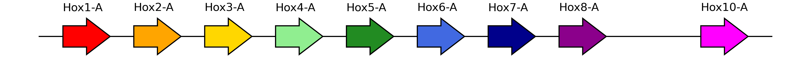

This approach becomes even more powerful when we are plotting the same
cluster in different instances, for example when there is a duplication
of the cluster:

``` python
on_chrom12 = gff["seqid"] == "pseudochrom_12"
is_gene = gff["type"] == "gene"

hoxb = gff[on_chrom12 & is_gene].copy().reset_index(drop=True)
hoxb["color"] = ["red", "orange", "darkblue", "magenta"]
hoxb
```

<div>
<style scoped>
    .dataframe tbody tr th:only-of-type {
        vertical-align: middle;
    }
&#10;    .dataframe tbody tr th {
        vertical-align: top;
    }
&#10;    .dataframe thead th {
        text-align: right;
    }
</style>

<table class="dataframe" data-quarto-postprocess="true" data-border="1">
<thead>
<tr style="text-align: right;">
<th data-quarto-table-cell-role="th"></th>
<th data-quarto-table-cell-role="th">seqid</th>
<th data-quarto-table-cell-role="th">source</th>
<th data-quarto-table-cell-role="th">type</th>
<th data-quarto-table-cell-role="th">start</th>
<th data-quarto-table-cell-role="th">end</th>
<th data-quarto-table-cell-role="th">score</th>
<th data-quarto-table-cell-role="th">strand</th>
<th data-quarto-table-cell-role="th">phase</th>
<th data-quarto-table-cell-role="th">attributes</th>
<th data-quarto-table-cell-role="th">gene_id</th>
<th data-quarto-table-cell-role="th">gene_name</th>
<th data-quarto-table-cell-role="th">color</th>
</tr>
</thead>
<tbody>
<tr>
<td data-quarto-table-cell-role="th">0</td>
<td>pseudochrom_12</td>
<td>PacBio</td>
<td>gene</td>
<td>1927066</td>
<td>1936157</td>
<td>.</td>
<td>-</td>
<td>.</td>
<td>ID=PB.9615;function=Homeobox domain;gene=Hox1-...</td>
<td>PB.9615</td>
<td>Hox1-B</td>
<td>red</td>
</tr>
<tr>
<td data-quarto-table-cell-role="th">1</td>
<td>pseudochrom_12</td>
<td>AUGUSTUS</td>
<td>gene</td>
<td>1998922</td>
<td>2024148</td>
<td>.</td>
<td>-</td>
<td>.</td>
<td>ID=g7718;function=sequence-specific DNA bindin...</td>
<td>g7718</td>
<td>Hox2-B</td>
<td>orange</td>
</tr>
<tr>
<td data-quarto-table-cell-role="th">2</td>
<td>pseudochrom_12</td>
<td>AUGUSTUS</td>
<td>gene</td>
<td>2565196</td>
<td>2594468</td>
<td>.</td>
<td>-</td>
<td>.</td>
<td>ID=g7723;function=sequence-specific DNA bindin...</td>
<td>g7723</td>
<td>Hox7-B</td>
<td>darkblue</td>
</tr>
<tr>
<td data-quarto-table-cell-role="th">3</td>
<td>pseudochrom_12</td>
<td>AUGUSTUS</td>
<td>gene</td>
<td>2986021</td>
<td>2996225</td>
<td>.</td>
<td>-</td>
<td>.</td>
<td>ID=g7725;function=sequence-specific DNA bindin...</td>
<td>g7725</td>
<td>Hox10-B</td>
<td>magenta</td>
</tr>
</tbody>
</table>

</div>

This cluster is missing Hox genes 3-6 and 8-9; we should add the
corresponding number of gaps in order for the plots to line up
accordingly:

``` python
hoxb = util.insert_gap(
    hoxb, "g7718", "g7723", "gene_id", no_gaps=4, purge_columns=["gene_name", "color"]
)
hoxb = util.insert_gap(
    hoxb, "g7723", "g7725", "gene_id", no_gaps=2, purge_columns=["gene_name", "color"]
)
hoxb
```

<div>
<style scoped>
    .dataframe tbody tr th:only-of-type {
        vertical-align: middle;
    }
&#10;    .dataframe tbody tr th {
        vertical-align: top;
    }
&#10;    .dataframe thead th {
        text-align: right;
    }
</style>

<table class="dataframe" data-quarto-postprocess="true" data-border="1">
<thead>
<tr style="text-align: right;">
<th data-quarto-table-cell-role="th"></th>
<th data-quarto-table-cell-role="th">seqid</th>
<th data-quarto-table-cell-role="th">source</th>
<th data-quarto-table-cell-role="th">type</th>
<th data-quarto-table-cell-role="th">start</th>
<th data-quarto-table-cell-role="th">end</th>
<th data-quarto-table-cell-role="th">score</th>
<th data-quarto-table-cell-role="th">strand</th>
<th data-quarto-table-cell-role="th">phase</th>
<th data-quarto-table-cell-role="th">attributes</th>
<th data-quarto-table-cell-role="th">gene_id</th>
<th data-quarto-table-cell-role="th">gene_name</th>
<th data-quarto-table-cell-role="th">color</th>
</tr>
</thead>
<tbody>
<tr>
<td data-quarto-table-cell-role="th">0</td>
<td>pseudochrom_12</td>
<td>PacBio</td>
<td>gene</td>
<td>1927066</td>
<td>1936157</td>
<td>.</td>
<td>-</td>
<td>.</td>
<td>ID=PB.9615;function=Homeobox domain;gene=Hox1-...</td>
<td>PB.9615</td>
<td>Hox1-B</td>
<td>red</td>
</tr>
<tr>
<td data-quarto-table-cell-role="th">1</td>
<td>pseudochrom_12</td>
<td>AUGUSTUS</td>
<td>gene</td>
<td>1998922</td>
<td>2024148</td>
<td>.</td>
<td>-</td>
<td>.</td>
<td>ID=g7718;function=sequence-specific DNA bindin...</td>
<td>g7718</td>
<td>Hox2-B</td>
<td>orange</td>
</tr>
<tr>
<td data-quarto-table-cell-role="th">2</td>
<td>pseudochrom_12</td>
<td>AUGUSTUS</td>
<td>gene</td>
<td>2024149</td>
<td>2024150</td>
<td>.</td>
<td>-</td>
<td>.</td>
<td>ID=g7718;function=sequence-specific DNA bindin...</td>
<td>gap_g7718-0</td>
<td></td>
<td></td>
</tr>
<tr>
<td data-quarto-table-cell-role="th">3</td>
<td>pseudochrom_12</td>
<td>AUGUSTUS</td>
<td>gene</td>
<td>2024151</td>
<td>2024152</td>
<td>.</td>
<td>-</td>
<td>.</td>
<td>ID=g7718;function=sequence-specific DNA bindin...</td>
<td>gap_g7718-1</td>
<td></td>
<td></td>
</tr>
<tr>
<td data-quarto-table-cell-role="th">4</td>
<td>pseudochrom_12</td>
<td>AUGUSTUS</td>
<td>gene</td>
<td>2024153</td>
<td>2024154</td>
<td>.</td>
<td>-</td>
<td>.</td>
<td>ID=g7718;function=sequence-specific DNA bindin...</td>
<td>gap_g7718-2</td>
<td></td>
<td></td>
</tr>
<tr>
<td data-quarto-table-cell-role="th">5</td>
<td>pseudochrom_12</td>
<td>AUGUSTUS</td>
<td>gene</td>
<td>2024155</td>
<td>2024156</td>
<td>.</td>
<td>-</td>
<td>.</td>
<td>ID=g7718;function=sequence-specific DNA bindin...</td>
<td>gap_g7718-3</td>
<td></td>
<td></td>
</tr>
<tr>
<td data-quarto-table-cell-role="th">6</td>
<td>pseudochrom_12</td>
<td>AUGUSTUS</td>
<td>gene</td>
<td>2565196</td>
<td>2594468</td>
<td>.</td>
<td>-</td>
<td>.</td>
<td>ID=g7723;function=sequence-specific DNA bindin...</td>
<td>g7723</td>
<td>Hox7-B</td>
<td>darkblue</td>
</tr>
<tr>
<td data-quarto-table-cell-role="th">7</td>
<td>pseudochrom_12</td>
<td>AUGUSTUS</td>
<td>gene</td>
<td>2594469</td>
<td>2594470</td>
<td>.</td>
<td>-</td>
<td>.</td>
<td>ID=g7723;function=sequence-specific DNA bindin...</td>
<td>gap_g7723-0</td>
<td></td>
<td></td>
</tr>
<tr>
<td data-quarto-table-cell-role="th">8</td>
<td>pseudochrom_12</td>
<td>AUGUSTUS</td>
<td>gene</td>
<td>2594471</td>
<td>2594472</td>
<td>.</td>
<td>-</td>
<td>.</td>
<td>ID=g7723;function=sequence-specific DNA bindin...</td>
<td>gap_g7723-1</td>
<td></td>
<td></td>
</tr>
<tr>
<td data-quarto-table-cell-role="th">9</td>
<td>pseudochrom_12</td>
<td>AUGUSTUS</td>
<td>gene</td>
<td>2986021</td>
<td>2996225</td>
<td>.</td>
<td>-</td>
<td>.</td>
<td>ID=g7725;function=sequence-specific DNA bindin...</td>
<td>g7725</td>
<td>Hox10-B</td>
<td>magenta</td>
</tr>
</tbody>
</table>

</div>

``` python
plot_synteny_schematic(hox)
plot_synteny_schematic(hoxb)
```


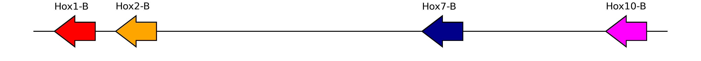

Sometimes we want to plot genes that belong to the same cluster but
because of assembly fragmentation they are not on the same
pseudomolecule.

``` python
on_scaff44 = gff["seqid"] == "scaffold_44"
is_gene = gff["type"] == "gene"

hoxc = gff[on_scaff44 & is_gene].copy().reset_index(drop=True)
hoxc["color"] = ["dodgerblue", "hotpink"]
hoxc["edge_color"] = "black"

interrupted = pd.concat((hox.loc[6:], hoxc)).reset_index(drop=True)
interrupted["offset"] = 0.02
interrupted = util.insert_break(interrupted, locus1="g9725", locus2="PB.1762")
interrupted
```

<div>
<style scoped>
    .dataframe tbody tr th:only-of-type {
        vertical-align: middle;
    }
&#10;    .dataframe tbody tr th {
        vertical-align: top;
    }
&#10;    .dataframe thead th {
        text-align: right;
    }
</style>

<table class="dataframe" data-quarto-postprocess="true" data-border="1">
<thead>
<tr style="text-align: right;">
<th data-quarto-table-cell-role="th"></th>
<th data-quarto-table-cell-role="th">seqid</th>
<th data-quarto-table-cell-role="th">source</th>
<th data-quarto-table-cell-role="th">type</th>
<th data-quarto-table-cell-role="th">start</th>
<th data-quarto-table-cell-role="th">end</th>
<th data-quarto-table-cell-role="th">score</th>
<th data-quarto-table-cell-role="th">strand</th>
<th data-quarto-table-cell-role="th">phase</th>
<th data-quarto-table-cell-role="th">attributes</th>
<th data-quarto-table-cell-role="th">gene_id</th>
<th data-quarto-table-cell-role="th">gene_name</th>
<th data-quarto-table-cell-role="th">color</th>
<th data-quarto-table-cell-role="th">offset</th>
<th data-quarto-table-cell-role="th">edge_color</th>
</tr>
</thead>
<tbody>
<tr>
<td data-quarto-table-cell-role="th">0</td>
<td>pseudochrom_56</td>
<td>AUGUSTUS</td>
<td>gene</td>
<td>2565196</td>
<td>2594468</td>
<td>.</td>
<td>+</td>
<td>.</td>
<td>ID=g9723;function=sequence-specific DNA bindin...</td>
<td>g9723</td>
<td>Hox7-A</td>
<td>darkblue</td>
<td>0.02</td>
<td>black</td>
</tr>
<tr>
<td data-quarto-table-cell-role="th">1</td>
<td>pseudochrom_56</td>
<td>AUGUSTUS</td>
<td>gene</td>
<td>2916314</td>
<td>2926445</td>
<td>.</td>
<td>+</td>
<td>.</td>
<td>ID=g9724;function=sequence-specific DNA bindin...</td>
<td>g9724</td>
<td>Hox8-A</td>
<td>darkmagenta</td>
<td>0.02</td>
<td>black</td>
</tr>
<tr>
<td data-quarto-table-cell-role="th">2</td>
<td>pseudochrom_56</td>
<td>AUGUSTUS</td>
<td>gene</td>
<td>2926446</td>
<td>2926447</td>
<td>.</td>
<td>+</td>
<td>.</td>
<td></td>
<td>gap_g9724-0</td>
<td></td>
<td></td>
<td>0.02</td>
<td>black</td>
</tr>
<tr>
<td data-quarto-table-cell-role="th">3</td>
<td>pseudochrom_56</td>
<td>AUGUSTUS</td>
<td>gene</td>
<td>2986021</td>
<td>2996225</td>
<td>.</td>
<td>+</td>
<td>.</td>
<td>ID=g9725;function=sequence-specific DNA bindin...</td>
<td>g9725</td>
<td>Hox10-A</td>
<td>magenta</td>
<td>0.02</td>
<td>black</td>
</tr>
<tr>
<td data-quarto-table-cell-role="th">4</td>
<td></td>
<td></td>
<td></td>
<td></td>
<td></td>
<td></td>
<td></td>
<td></td>
<td></td>
<td>break</td>
<td></td>
<td></td>
<td></td>
<td></td>
</tr>
<tr>
<td data-quarto-table-cell-role="th">5</td>
<td>scaffold_44</td>
<td>PacBio</td>
<td>gene</td>
<td>1927066</td>
<td>1936157</td>
<td>.</td>
<td>-</td>
<td>.</td>
<td>ID=PB.1762;function=Homeobox domain;gene=Hox11...</td>
<td>PB.1762</td>
<td>Hox11</td>
<td>dodgerblue</td>
<td>0.02</td>
<td>black</td>
</tr>
<tr>
<td data-quarto-table-cell-role="th">6</td>
<td>scaffold_44</td>
<td>AUGUSTUS</td>
<td>gene</td>
<td>1998922</td>
<td>2024148</td>
<td>.</td>
<td>-</td>
<td>.</td>
<td>ID=g13061;function=sequence-specific DNA bindi...</td>
<td>g13061</td>
<td>Hox12</td>
<td>hotpink</td>
<td>0.02</td>
<td>black</td>
</tr>
</tbody>
</table>

</div>

``` python
plot_synteny_schematic(interrupted, interrupted=True)
```

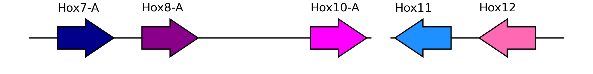
