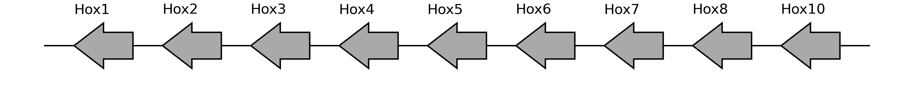
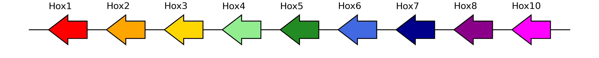
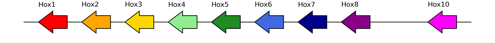

# geneorder


<!-- WARNING: THIS FILE WAS AUTOGENERATED! DO NOT EDIT! -->

This package was born out of my continuous efforts to write streamlined
code to plot Hox gene clusters. It seems like this is a task I will be
performing many times, and there don’t seem to be too many tools out
there, so I wrote my own. This is my `matplotlib`-based answer, and I
hope that it is useful to you, too.

## Input

Generally, the package expects you to have, at least, knowledge of the
gene IDs that you want to visualize, and knowledge of their coordinates
in the genome. This can be manually encoded or come in table form -
crucially, it can be read from a GFF3 file.

## Usage

### Installation

Install latest from the GitHub
[repository](https://github.com/galicae/geneorder):

``` sh
$ pip install git+https://github.com/galicae/geneorder.git
```

or from [pypi](https://pypi.org/project/geneorder/)

``` sh
$ pip install geneorder
```

### Documentation

Documentation can be found hosted on this GitHub
[repository](https://github.com/galicae/geneorder)’s
[pages](https://galicae.github.io/geneorder/). Additionally you can find
package manager specific guidelines on
[pypi](https://pypi.org/project/geneorder/).

## How to use

The most basic `geneorder` use case is when you have a list of genes
that are co-linear and would like to plot them in their chromosomal
context. The least information that is needed for that is

- the chromosome name
- the gene IDs/names
- the starts/ends of all genes
- the strand and orientation of the genes

``` python
import pandas as pd

from geneorder.core import plot_synteny_schematic
```

``` python
gene_dict = {
    "gene_name": [
        "Hox1",
        "Hox2",
        "Hox3",
        "Hox4",
        "Hox5",
        "Hox6",
        "Hox7",
        "Hox8",
        "Hox10",
    ],
    "gene_id": [
        "PB.8615",
        "g9718",
        "PB.8616",
        "g9720",
        "g9721",
        "PB.8617",
        "g9723",
        "g9724",
        "g9725",
    ],
    "start": [
        1927066,
        1998922,
        2058396,
        2195412,
        2351936,
        2373415,
        2565196,
        2916314,
        2986021,
    ],
    "end": [
        1936157,
        2024148,
        2065953,
        2206712,
        2354374,
        2375678,
        2594468,
        2926445,
        2996225,
    ],
}

minimal = pd.DataFrame(gene_dict)
minimal["seqid"] = "pseudochrom_56"
minimal["strand"] = "-"
```

``` python
minimal
```

<div>
<style scoped>
    .dataframe tbody tr th:only-of-type {
        vertical-align: middle;
    }
&#10;    .dataframe tbody tr th {
        vertical-align: top;
    }
&#10;    .dataframe thead th {
        text-align: right;
    }
</style>

<table class="dataframe" data-quarto-postprocess="true" data-border="1">
<thead>
<tr style="text-align: right;">
<th data-quarto-table-cell-role="th"></th>
<th data-quarto-table-cell-role="th">gene_name</th>
<th data-quarto-table-cell-role="th">gene_id</th>
<th data-quarto-table-cell-role="th">start</th>
<th data-quarto-table-cell-role="th">end</th>
<th data-quarto-table-cell-role="th">seqid</th>
<th data-quarto-table-cell-role="th">strand</th>
</tr>
</thead>
<tbody>
<tr>
<td data-quarto-table-cell-role="th">0</td>
<td>Hox1</td>
<td>PB.8615</td>
<td>1927066</td>
<td>1936157</td>
<td>pseudochrom_56</td>
<td>-</td>
</tr>
<tr>
<td data-quarto-table-cell-role="th">1</td>
<td>Hox2</td>
<td>g9718</td>
<td>1998922</td>
<td>2024148</td>
<td>pseudochrom_56</td>
<td>-</td>
</tr>
<tr>
<td data-quarto-table-cell-role="th">2</td>
<td>Hox3</td>
<td>PB.8616</td>
<td>2058396</td>
<td>2065953</td>
<td>pseudochrom_56</td>
<td>-</td>
</tr>
<tr>
<td data-quarto-table-cell-role="th">3</td>
<td>Hox4</td>
<td>g9720</td>
<td>2195412</td>
<td>2206712</td>
<td>pseudochrom_56</td>
<td>-</td>
</tr>
<tr>
<td data-quarto-table-cell-role="th">4</td>
<td>Hox5</td>
<td>g9721</td>
<td>2351936</td>
<td>2354374</td>
<td>pseudochrom_56</td>
<td>-</td>
</tr>
<tr>
<td data-quarto-table-cell-role="th">5</td>
<td>Hox6</td>
<td>PB.8617</td>
<td>2373415</td>
<td>2375678</td>
<td>pseudochrom_56</td>
<td>-</td>
</tr>
<tr>
<td data-quarto-table-cell-role="th">6</td>
<td>Hox7</td>
<td>g9723</td>
<td>2565196</td>
<td>2594468</td>
<td>pseudochrom_56</td>
<td>-</td>
</tr>
<tr>
<td data-quarto-table-cell-role="th">7</td>
<td>Hox8</td>
<td>g9724</td>
<td>2916314</td>
<td>2926445</td>
<td>pseudochrom_56</td>
<td>-</td>
</tr>
<tr>
<td data-quarto-table-cell-role="th">8</td>
<td>Hox10</td>
<td>g9725</td>
<td>2986021</td>
<td>2996225</td>
<td>pseudochrom_56</td>
<td>-</td>
</tr>
</tbody>
</table>

</div>

``` python
plot_synteny_schematic(minimal)
```



The plot can be customized, e.g. by including color:

``` python
minimal["color"] = [
    "red",
    "orange",
    "gold",
    "lightgreen",
    "forestgreen",
    "royalblue",
    "darkblue",
    "darkmagenta",
    "magenta",
]

plot_synteny_schematic(minimal)
```



We can also edit the dataframe to indicate missing genes:

``` python
from geneorder import util
```

``` python
minimal = util.insert_gap(
    minimal,
    "Hox8",
    "Hox10",
    "gene_name",
    no_gaps=1,
    purge_columns=["gene_id", "color"],
)
```

``` python
plot_synteny_schematic(minimal)
```



For more details, please refer to the
[documentation](https://galicae.github.io/geneorder/).
